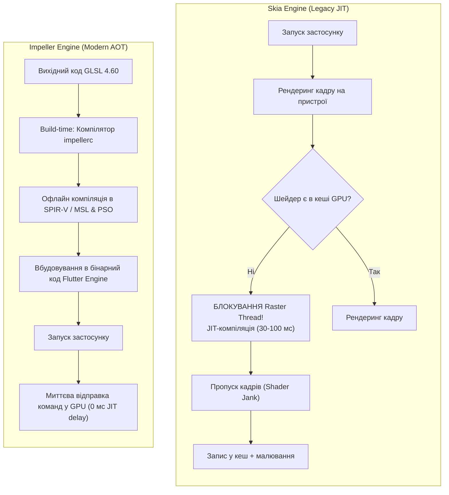
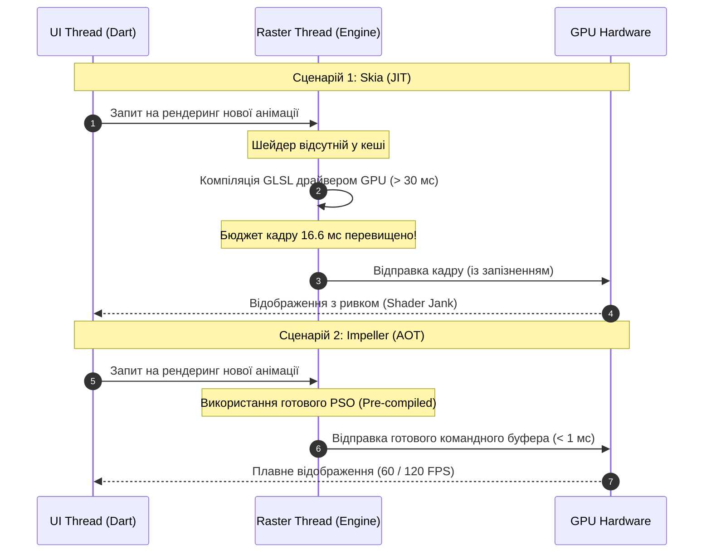

# Практична робота 2: Технологія Flutter
# Варіант 3: Порівняння рушіїв рендерингу Skia та Impeller у Flutter

---

## 1. Механізм компіляції шейдерів: Skia (JIT) проти Impeller (AOT)

Шейдер — це спеціальна програма, що виконується безпосередньо на GPU і обчислює колір кожного пікселя (затінення, градієнти, размиття, скруглення кутів тощо).

### Skia (JIT — Just-In-Time)
1. **Динамічна компіляція:** Skia генерує та компілює шейдери безпосередньо **під час виконання застосунку** (`runtime`), коли на екрані вперше з'являється новий віджет із певним графічним ефектом.
2. **Залежність від драйвера:** Компіляція сирого коду GLSL/Metal у машинні команди GPU виконується графічним драйвером безпосередньо на пристрої користувача в момент рендерингу.

### Impeller (AOT — Ahead-Of-Time)
1. **Статична компіляція:** Impeller переносить етап компіляції шейдерів із `runtime` на етап збірки проєкту (`build-time`).
2. **Офлайн-компілятор `impellerc`:** Усі шейдери пишуться мовою **GLSL 4.60** і під час збірки компілюються у проміжний байт-код (SPIR-V для Vulkan / MSL для Metal).
3. **Заздалегідь створені PSO:** Об'єкти стану конвеєра (Pipeline State Objects, PSO) будуються заздалегідь. У момент виконання Impeller лише відправляє готові командні буфери в GPU без затримок.

---

## 2. Природа «затинання при першому показі анімації» (Shader Jank)

Бюджет одного кадру при частоті оновлення екрана 60 Гц становить **16.6 мс** (при 120 Гц — **8.3 мс**).

* **Причина затинання у Skia:** Коли користувач уперше активує анімацію із новим ефектом (наприклад, `BackdropFilter` або `CustomPainter`), Skia ініціює JIT-компіляцію. Драйверу GPU потрібно від **30 до 100+ мс** для компіляції шейдера.
* **Наслідок:** Растровий потік (Raster Thread) блокується, через що Flutter пропускає від 2 до 6 кадрів поспіль. Користувач спостерігає помітний ривок анімації. При повторному запуску цієї ж анімації шейдер береться з кешу, і ривок зникає.
* **Рішення в Impeller:** Оскільки всі шейдери компілюються AOT при збірці застосунку, час на компіляцію під час виконання дорівнює **0 мс**.

---

## 3. Діаграми порівняння механізмів рендерингу (Mermaid)

### Діаграма 1. Конвеєр компіляції шейдерів (Skia JIT vs Impeller AOT)

### Діаграма 2. Поведінка графічного конвеєра під час виклику нової анімації

---
